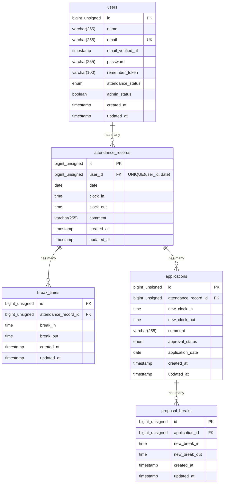
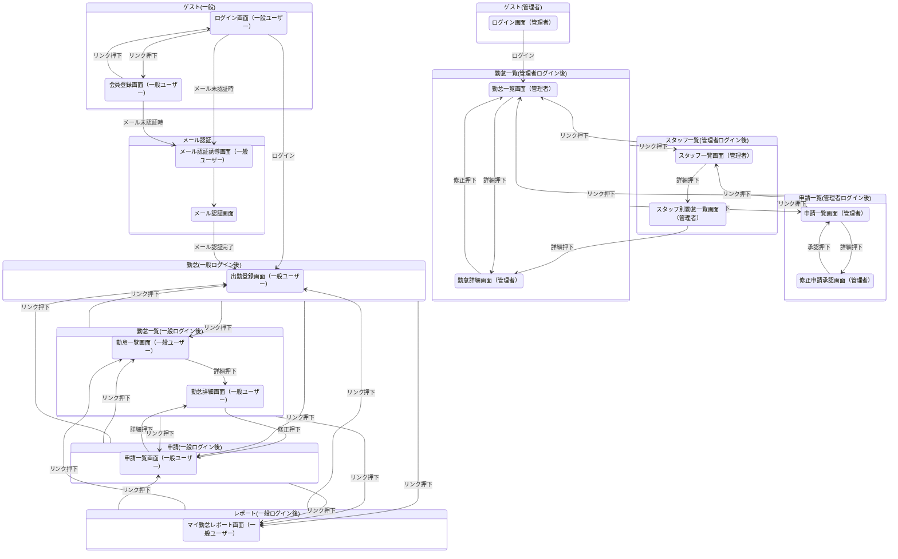

# COACHTECH　勤怠管理アプリ

## 概要
COACHTECH 模擬案件1にて作成の、勤怠管理アプリです。

勤怠の打刻と管理を行うアプリになります。
- 一般ユーザーにて勤怠打刻(出勤・退勤・休憩)と勤怠レポートの確認、打刻した勤怠の修正申請を行う機能
- 管理者にて一般ユーザーが打刻した勤怠情報と申請の確認を行う機能

## 使用技術
- OS（Dockerが動作する任意のOS）: macOS
- PHP : 8.5.8
- Laravel : 10.50.3
- DB : MySQL 8.4.10
- フロントエンド : Vite, Figmaデザイン
- 開発ツール : Docker, Laravel Sail, phpMyAdmin 5.2.3,
- その他使用技術 : Laravel Fortify, メールの認証機能, Laravel Sanctum 3.3.3, Laravel PHPUnit, streamDownloadによるCSVのDL, API

## ログイン情報
- ユーザー1（一般）
user1@example.com
password

- ユーザー2（一般）
user2@example.com
password

- ユーザー3（管理者）
user3@example.com
password

## 開発環境URL
### 会員登録画面（一般ユーザー）
- http://localhost/register

### メール認証誘導画面（一般ユーザー）
- http://localhost/email/verify

### ログイン画面（一般ユーザー）
- http://localhost/login

### 出勤登録画面（一般ユーザー）
- http://localhost/attendance

### 勤怠一覧画面（一般ユーザー）
- http://localhost/attendance/list

### 勤怠詳細画面（一般ユーザー）
- http://localhost/attendance/{id}

### 申請一覧画面（一般ユーザー）
- http://localhost/stamp_correction_request/list

### マイ勤怠レポート画面（一般ユーザー）
- http://localhost/attendance/report

### ログイン画面（管理者）
- http://localhost/admin/login

### 勤怠一覧画面（管理者）
- http://localhost/admin/attendance/list

### 勤怠詳細画面（管理者）
- http://localhostadmin/attendance/{id}

### スタッフ一覧画面（管理者）
- http://localhost/admin/staff/list

### スタッフ別勤怠一覧画面（管理者）
- http://localhost/admin/attendance/staff/{id}

### 申請一覧画面（管理者）
- http://localhost/stamp_correction_request/list

### 修正申請承認画面（管理者）
- http://localhost/stamp_correction_request/approve/{attendance_correct_request_id}

## APIエンドポイント一覧
下記の通り実装済。

### 勤怠一覧(認証不要)
- メソッド：GET
- URL：http://localhost/api/v1/attendance-records
- リクエストパラメータ
user_id 任意	ユーザーIDで絞り込み
date 任意	日付で絞り込み（YYYY-MM-DD）
month 任意	YYYY-MM 形式の年月で絞り込み
page 任意	ページ番号（デフォルト: 1）
per_page 任意	1ページあたりの件数（デフォルト: 20、最大: 100）

### 勤怠詳細(認証不要)
- メソッド：GET
- http://localhost/api/v1/attendance-records/{attendanceRecord}

### 勤怠登録(認証必須)
- メソッド：POST
- URL：http://localhost/api/v1/attendance-records
- リクエストボディ
date 必須	勤怠日（YYYY-MM-DD）
clock_in 必須	出勤時刻（HH:MM:SS）
clock_out 任意	退勤時刻（HH:MM:SS、clock_in より後）
comment 任意	備考（max:255）

### 勤怠更新(認証必須)
- メソッド：PUT
- URL：http://localhost/api/v1/attendance-records/{attendanceRecord}
- リクエストボディ
date 変更する場合必須	勤怠日（YYYY-MM-DD）
clock_in 変更する場合必須	出勤時刻（HH:MM:SS）
clock_out 任意	退勤時刻（HH:MM:SS、clock_in より後）
comment 任意	備考（max:255）

### 勤怠削除(認証必須)
- メソッド：DELETE
- URL：http://localhost/api/v1/attendance-records/{attendanceRecord}

## ER図


## 画面遷移図


## 環境構築手順
### 1. 前提
以下がインストールされていること
- Git
- Docker Desktop
- GitHubへアクセスできる環境

### 2. GitHubからリポジトリをクローン
リポジトリをクローンしたいディレクトリで以下のコマンドを実行する

```bash
git clone https://github.com/yuto-oshima18/attendance-app.git
cd attendance-app
```

### 3. Composerパッケージをインストール
以下のDockerコマンドを実行してComposerパッケージをインストールする

```bash
docker run --rm \
    -u "$(id -u):$(id -g)" \
    -v "$(pwd):/var/www/html" \
    -w /var/www/html \
    -e COMPOSER_CACHE_DIR=/tmp/composer_cache \
    laravelsail/php82-composer:latest \
    composer install
```

### 4. 環境変数ファイルを作成

```bash
cp .env.example .env
```

### 5. フロントエンドのセットアップ (Vite)　
フロントエンドのスタイリングにTailwind CSSを使用します。

1. Sailコンテナの起動
```bash
./vendor/bin/sail up -d
```

※M1/M2/M3 Mac（Apple Silicon）をお使いの方
Apple Silicon搭載のMacでは、`sail up -d`実行時に以下のエラーが発生することがあります：
```bash
no matching manifest for linux/arm64/v8

解決方法: `compose.yaml`を開き、mysqlサービスに`platform: 'linux/amd64'`を追加してください。
mysql:
    image: 'mysql/mysql-server:8.0'
    platform: 'linux/amd64'  # ← この行を追加
    ports:
```

2. NPM依存パッケージのインストール
```bash
./vendor/bin/sail npm install
```

3. Vite開発サーバーの起動確認
```bash
# 注意: ./vendor/bin/sail npm run dev は実行したままにしておく必要があります。(新規ターミナル推奨)
./vendor/bin/sail npm run dev
```

### 6. Sailのエイリアス設定
リポジトリのルートで以下のコマンドを実行する

```bash
# エイリアスを設定して 'sail' だけでコマンドを実行できるようにする
echo "alias sail='[ -f sail ] && bash sail || bash vendor/bin/sail'" >> ~/.zshrc

# または bash の場合
# echo "alias sail='[ -f sail ] && bash sail || bash vendor/bin/sail'" >> ~/.bashrc

# シェルを再起動するか、新しいターミナルを開いてエイリアスを有効にする
exec $SHELL
```

### 7. アプリケーションキーの生成
リポジトリのルートで以下のコマンドを実行する

```bash
sail artisan key:generate
```

### 8. データベースのマイグレーションと初期データ投入
以下のコマンドでテーブルを作成し、初期データを投入する

```bash
# 既存のデータベースをリセットして初期レコードを投入
sail artisan migrate:fresh --seed
```

## テスト方法
下記のコマンドを実行する
passed/deprecatedのみ表示されること

```bash
sail artisan test
```

## その他
### ミドルウェア画面
- phpMyAdmin: http://localhost:8080
- Mailpit: http://localhost:8025

### 備考
初期データ投入の際、要件により当月の勤怠情報を17日分作成しているため、既に当日分の勤怠が存在する可能性があります。<br>
実際の画面より勤怠情報を登録する際はphpMyAdminより現在の日付と現在の日付より後の勤怠情報を確認し、存在する場合は全て削除してください。<br>

## 作成者
大島 佑斗