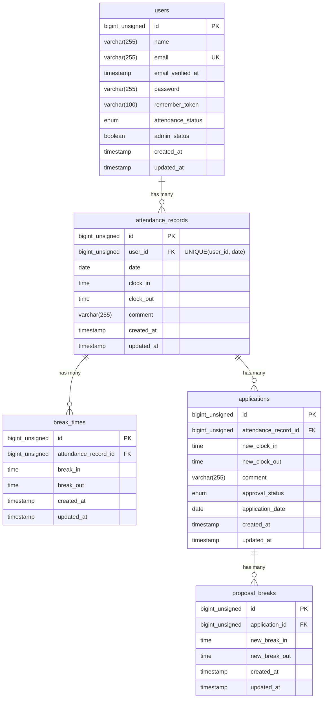

```mermaid
erDiagram
    users {
        bigint_unsigned id PK
        varchar(255) name
        varchar(255) email UK
        timestamp email_verified_at
        varchar(255) password
        varchar(100) remember_token
        enum attendance_status
        boolean admin_status
        timestamp created_at
        timestamp updated_at
    }
    
    attendance_records {
        bigint_unsigned id PK
        bigint_unsigned user_id FK "UNIQUE(user_id, date)"
        date date 
        time clock_in
        time clock_out
        varchar(255) comment
        timestamp created_at
        timestamp updated_at
    }
    
    break_times {
        bigint_unsigned id PK
        bigint_unsigned attendance_record_id FK
        time break_in
        time break_out
        timestamp created_at
        timestamp updated_at
    }

    applications {
        bigint_unsigned id PK
        bigint_unsigned attendance_record_id FK
        time new_clock_in
        time new_clock_out
        varchar(255) comment
        enum approval_status
        date application_date
        timestamp created_at
        timestamp updated_at
    }

    proposal_breaks {
        bigint_unsigned id PK
        bigint_unsigned application_id FK
        time new_break_in
        time new_break_out
        timestamp created_at
        timestamp updated_at
    }
    
    users ||--o{ attendance_records : "has many"
    attendance_records ||--o{ break_times : "has many"
    attendance_records ||--o{ applications : "has many"
    applications ||--o{ proposal_breaks : "has many"
```